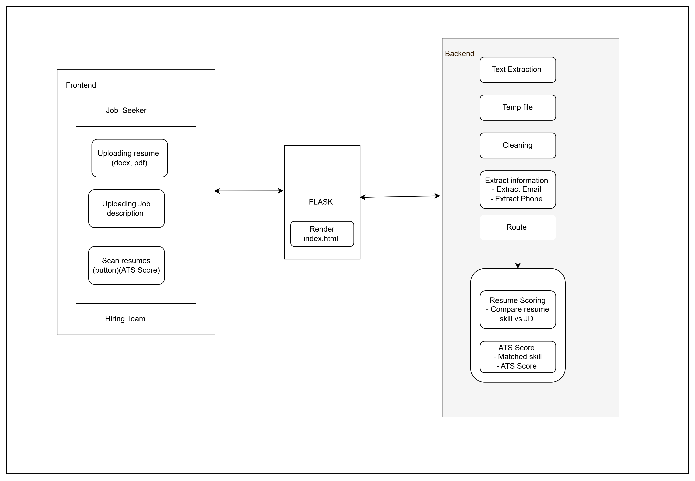
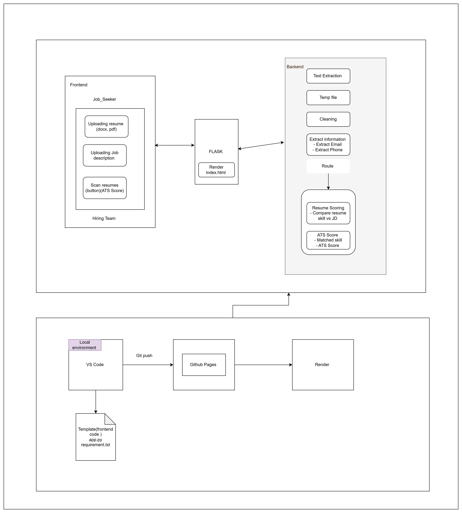

# ATS_Resume_Scanner
 ## Overview 
 The ATS Resume Scanner is an application that helps automate the process of resume screening for recruiters. It compares resumes with job descriptions and provides an ATS score based on skill matching. The application extracts key information from resumes such as skills, experience, and education, and compares them with job descriptions to calculate the compatibility score.

This project aims to improve hiring efficiency by reducing manual resume screening time, enhancing candidate evaluation, and providing feedback for both job seekers and hiring teams.

## Features 
**1. For Job Seekers:**
- Upload resumes (in PDF or DOCX format).
- Match resumes against job descriptions.
- Get an ATS score and feedback on missing skills.
- See improvement areas based on job description analysis.

**2. For Hiring Teams:**
- Upload job descriptions (in PDF or DOCX format).
- Upload multiple job seeker resumes.
- Evaluate resumes against the job description.
- See a ranked list of candidates based on ATS scores.

## Technologies Used
- **Backend:** Python 3, Flask
- **Web Server:** Gunicorn (for production deployment)
- **Frontend:** HTML, CSS
- **PDF Parsing:** pdfplumber
- **DOCX Parsing:** python-docx
- Deployment: Render (for backend deployment), GitHub Pages (for frontend deployment)

## Folder Structure 
```
.
├── README.md                         # Project documentation
├── app.py                            # Main Flask application file
├── requirements.txt                  # Python dependencies
├── templates                         # HTML templates for frontend
│   ├── hiring_team_results.html      # Results page for Hiring Team
│   ├── index.html                    # Main page
│   └── job_seeker_results.html       # Results page for Job Seekers
---------------#trial
└── web                               # Frontend static files
    ├── app.py                        # (Optional) Flask app if needed for frontend
    ├── requirement.txt               # Dependencies for frontend (if any)
    └── templates                     # HTML files for frontend
        ├── hiring_team_results.html  # Results page for Hiring Team (Frontend)
        ├── index.html                # Main page (Frontend)
        └── job_seeker_results.html   # Results page for Job Seekers (Frontend)
```
## Architecture 
- Logic flow 

- System Diagram 

## Setup Instructions
### Prerequisites
```
Python 3.x
Pip (Python package installer)
Git (for version control)
```

### Installation

* Clone the repository:
```
git clone https://github.com/your-username/ats-resume-scanner.git
cd ats-resume-scanner
```

* Create a virtual environment:
```
python3 -m venv venv
source venv/bin/activate  # For Linux/macOS
venv\Scripts\activate     # For Windows
```

* Install dependencies:
````
pip install -r requirements.txt
````

* Run the application locally:
```
python app.py
```

By default, the app will run on http://127.0.0.1:5000/. Open this URL in your browser to access the ATS Resume Scanner.

## Backend Flow

**Job Seeker Role:**

- Upload resume(s).
- The system extracts skills and compares them with job description text or file.
- A match score is calculated and presented with recommendations for improvement.

**Hiring Team Role:**

- Upload job description and resume(s).
- The system calculates ATS scores for job seekers.
- Hiring teams can view ranked candidates based on their compatibility with the job description.

**How It Works**
- Resume Parsing:
- PDF: pdfplumber extracts text from PDF files.
- DOCX: python-docx extracts text from DOCX files.
- Skills Matching:
- A predefined list of skills is matched against text in resumes and job descriptions.
- A similarity score is calculated based on the presence of these skills.
- Candidate Ranking
- Based on ATS score, candidates are ranked from best to least fit.

## Deployment
- Deploying on Render (Backend)
- Push your project to GitHub.
- Go to Render
- sign up, and connect your GitHub repository.
- Create a new Web Service.
- Select the repository and branch (usually main).
- Set the Build Command to pip install -r requirements.txt.
- Set the Start Command to gunicorn app:app.
- Deploy the service, and Render will give you a URL for your app (e.g., https://your-app-name.onrender.com).
- Deploying on GitHub Pages (Frontend)
- Ensure that your frontend is inside the web folder, including the HTML, CSS, and JavaScript files.
- Push your frontend files to GitHub.
- Go to the GitHub repository settings and scroll down to GitHub Pages.
- Under Source, select main (or master branch) and the /web folder (if needed).
- GitHub will provide you with a link to your frontend website (e.g., https://username.github.io/repository-name/).

## Testing

To ensure the system works correctly, you can add unit tests for the core functions (like skill extraction and score calculation). Add tests to test.py and run them with:
```
python -m unittest test.py
```

## Future Improvements
- Integration with Other Platforms
- Enhanced NLP for Better Resume Matching
- AI-Powered Candidate Ranking
- Real-Time Job Description Parsing
- Multi-Language Support
- User Personalization Features